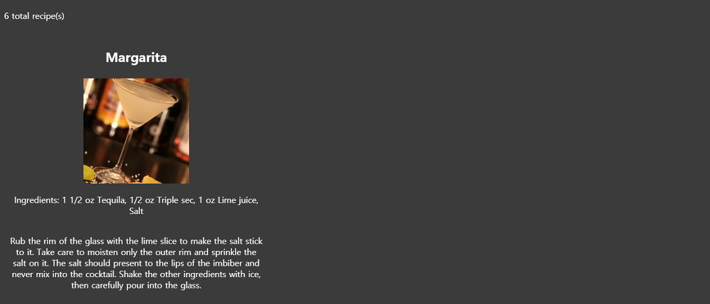

# Libation Station

# Check it out here
https://victoriaroda.github.io/Libation-Station/

# Summary
This is a new app that features a search by cocktail name or try something new with a random drink recipe.

# How it works
I used HTML, CSS, JavaScript, and jQuery to develop a simple way to search for alcoholic drink recipes. 

Enter a drink name to find recipes for that drink. If you are interested in a drink you have never had before, the random drink recipe feature will pop out a random recipe and will keep giving you a new one every time you click to generate one. Keep clicking until you find one you like!

# Screenshots

# Acknowledgements
TheCocktailDB
https://www.thecocktaildb.com/api.php
